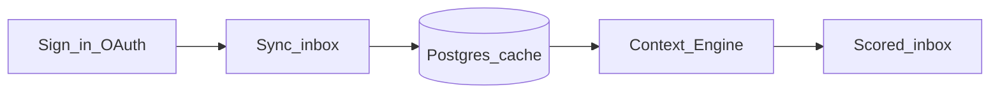

# Vigil

> An intelligent gatekeeper for your email.

Vigil helps you cut through inbox noise across **Gmail** and **Microsoft Outlook**. Connect your accounts, sync messages into one place, and let the **Context Engine** score and classify mail against what you actually care about — so critical threads surface and low-value mail fades into the background.

## What Vigil does

- **Unified inbox** — Gmail and Microsoft mail in one feed at [`/dashboard/inbox`](src/app/(protected)/dashboard/inbox/page.tsx).
- **Sync on your terms** — Choose providers, date range, and batch size; run one batch or **Auto sync** until caught up.
- **AI triage** — Each message can get a **Vigil score**, **category** (Critical / Relevant / Low-Value), a short **summary**, and **extracted actions** (tasks the model spotted in the thread).
- **Context Engine** — Define natural-language **Intents** (goals with optional deadlines) at [`/dashboard/intents`](src/app/(protected)/dashboard/intents/page.tsx); classification weighs mail against your active intents.
- **Your rules** — Set a free-text **classification policy** and optional AI tuning at [`/dashboard/settings`](src/app/(protected)/dashboard/settings/page.tsx).
- **Live updates** — When Supabase Realtime is configured, the inbox refreshes AI fields as analysis completes without a full page reload.

## How it works



1. **Sign in** with Google and/or Microsoft OAuth.
2. **Sync** pulls messages from linked providers into your private Postgres cache (Supabase).
3. The **Context Engine** (FastAPI worker) classifies each message using embeddings, your intents, and optional web context.
4. You **triage** in the inbox with filters, scores, and summaries.

For a feature-by-feature walkthrough, see [docs/features.md](docs/features.md).

## Who it's for

Vigil is for people who juggle **multiple mailboxes** and want **intent-aware triage** instead of static folders or manual rules. It is early-stage software: core sync, intents, and AI classification are in place; alerts, digests, and chat are on the [roadmap](product-development-plan.md).

## Tech stack

| Layer | Technology |
| --- | --- |
| Web app | Next.js 16 (App Router), TypeScript, Tailwind CSS v4, Shadcn UI |
| Auth | Auth.js v5 — Google + Microsoft Entra ID, database sessions |
| Database | Prisma 6 on Supabase Postgres (pgvector for embeddings) |
| Mail APIs | Gmail API, Microsoft Graph |
| AI backend | FastAPI — MiniLM embeddings, pluggable LLM (Groq, Ollama, OpenAI-compatible) |
| Tooling | [bun](https://bun.sh/) (package manager), [uv](https://docs.astral.sh/uv/) (Python backend) |

The repo is a **monorepo**: Next.js at the root, FastAPI in [`backend/`](backend/).

## Quick start

```bash
bun install && cp .env.example .env.local
bun run prisma:deploy && bun run dev
```

Then open [http://localhost:3000](http://localhost:3000).

**Full setup** (Supabase, OAuth, env vars, AI backend) → [docs/getting-started.md](docs/getting-started.md)

**Docker** (containerized web + API):

```bash
cp .env.docker.example .env.docker   # fill in secrets
docker compose up --build
```

See [docs/docker.md](docs/docker.md) for profiles (`local-db`, `ollama`) and production compose.

## Documentation

| Document | Description |
| --- | --- |
| [docs/README.md](docs/README.md) | Documentation index |
| [docs/features.md](docs/features.md) | Product features and user workflows |
| [docs/getting-started.md](docs/getting-started.md) | Install, OAuth, database, FastAPI, troubleshooting |
| [docs/architecture.md](docs/architecture.md) | Request flows, security, module map |
| [docs/data-and-sync.md](docs/data-and-sync.md) | Data model, sync behavior, Realtime |
| [docs/development.md](docs/development.md) | Scripts, testing, CI, environment reference |
| [docs/docker.md](docs/docker.md) | Docker Compose, images, profiles, production |
| [backend/README.md](backend/README.md) | Context Engine API, webhooks, processing pipeline |

## Roadmap

Planned next steps from the [product development plan](product-development-plan.md):

- **Telegram bypass alerts** for high-priority mail
- **Digest and optimization** loops
- **RAG / chat** experience over your classified inbox
