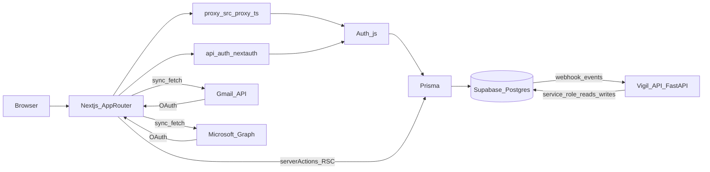
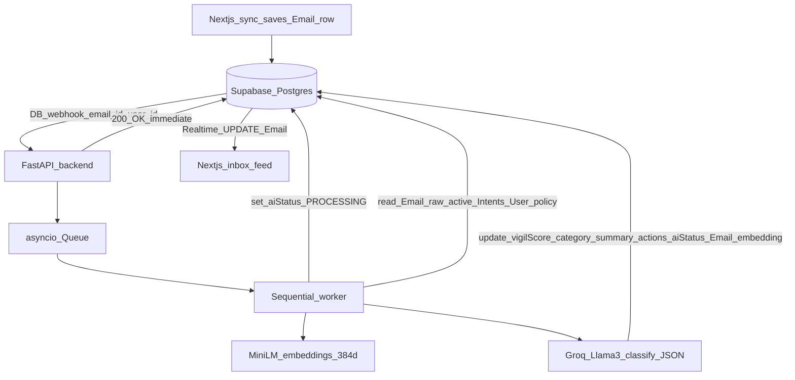

# Architecture

## Product context

Vigil is an email gatekeeper: users sign in with OAuth, sync Gmail and/or Microsoft mail into Postgres, define **Intents** and classification preferences, and triage in a unified inbox with AI-assigned scores and categories. The FastAPI service in [`backend/`](../backend/) is the **Context Engine** that classifies mail against those intents.

For user-facing behavior and limits, see [features.md](features.md). For setup, see [getting-started.md](getting-started.md).

## High-level stack

- **App Router** (`src/app/`) serves pages and Server Components; the global inbox uses a **server action** to sync and client components for search UI.
- **`src/proxy.ts`** — This repo uses `src/proxy.ts` as a **middleware-like request guard** for `/dashboard/:path*`. It wraps **Auth.js** and redirects unauthenticated users to `/signin` with a `callbackUrl`. See the [`matcher` in `src/proxy.ts`](../src/proxy.ts).
- **Auth.js** main instance: [`src/auth.ts`](../src/auth.ts) (Prisma adapter, database sessions). Edge-safe provider config: [`src/auth.config.ts`](../src/auth.config.ts) (Google + Microsoft Entra ID scopes, `authorized` callback).
- **API route** [`src/app/api/auth/[...nextauth]/route.ts`](../src/app/api/auth/[...nextauth]/route.ts) exports `GET` / `POST` handlers from `auth.ts`.
- **Supabase JWT for Realtime** — [`src/app/api/supabase-access-token/route.ts`](../src/app/api/supabase-access-token/route.ts): **`POST` only** mints a short-lived HS256 JWT (`Cache-Control: no-store`); **`GET` returns 405**. In-memory **rate limiting** via [`src/lib/rate-limit-memory.ts`](../src/lib/rate-limit-memory.ts). Signing: [`src/lib/supabase/sign-access-token.ts`](../src/lib/supabase/sign-access-token.ts).
- **Production session safety** — [`src/lib/ensure-auth-secret.ts`](../src/lib/ensure-auth-secret.ts) is loaded from [`src/auth.ts`](../src/auth.ts) so the process **throws** in production if `AUTH_SECRET` is unset.
- **HTTP security headers** — global response headers (CSP, `X-Content-Type-Options`, `Referrer-Policy`, `Permissions-Policy`, `X-Frame-Options`, production **HSTS**) are defined in [`next.config.ts`](../next.config.ts).
- **Token refresh** for Gmail/Graph: [`src/lib/tokens.ts`](../src/lib/tokens.ts) reads/writes `Account` rows and refreshes access tokens as needed; fetchers call `getValidAccessToken`.
- **Email integration**: [`src/lib/email/gmail.ts`](../src/lib/email/gmail.ts), [`src/lib/email/microsoft-graph.ts`](../src/lib/email/microsoft-graph.ts), orchestrated by [`src/lib/email/sync.ts`](../src/lib/email/sync.ts).

## Request flows

### 1) Sign-in and session

1. User opens `/signin` and uses OAuth (Google and/or Microsoft). Redirect URIs are the Auth.js callback URLs under `/api/auth/callback/...`.
2. Auth.js persists **database sessions** (`Session` table) and **accounts** with `access_token`, `refresh_token`, and `expires_at` on the `Account` row ([`prisma/schema.prisma`](../prisma/schema.prisma)).
3. `requireUser()` in [`src/lib/auth.ts`](../src/lib/auth.ts) calls `auth()`; if unauthenticated, it **redirects** to `/signin` (used by protected server pages).

### 2) Inbox sync (server action)

1. User triggers **Sync inbox** in [`InboxFeed`](../src/components/inbox-feed.tsx) → [`syncInboxAction`](../src/lib/email/actions.ts) (`"use server"`).
2. `requireUser()` ensures a logged-in user; [`syncInboxForUser`](../src/lib/email/sync.ts) runs based on **Sync options** from the UI:
   - provider selection (Google / Microsoft)
   - date range
   - mode: `refetchRecent` or `backfillMissingRaw`
   - batch size + cursor (drives **Sync next batch**)

   The UI also supports **Auto sync**, which repeatedly submits “next batch” until the cursor is exhausted (or the user presses **Stop**).

   Providers are synced in parallel when multiple are selected/linked. For each provider, the sync fetches messages for the batch, captures the provider payload into `Email.raw` (including body when available), stores **`threadId`** when the provider returns it, then **batch-loads existing rows** and **upserts with bounded concurrency** before `revalidatePath("/dashboard/inbox")`. Provider failures are mapped to **user-safe messages** and the full error is **logged server-side** ([`sync-user-messages.ts`](../src/lib/email/sync-user-messages.ts)); the sync also logs timing (`fetch_ms`, `upsert_ms`, `total_ms`) for performance debugging.

### 2b) Intents and settings (server actions)

1. **`/dashboard/intents`** — [`upsertIntentAction`](../src/lib/intents/actions.ts), [`deleteIntentAction`](../src/lib/intents/actions.ts), [`toggleIntentActiveAction`](../src/lib/intents/actions.ts) all call `requireUser()`, scope by `userId`, and `revalidatePath` the intents and inbox routes.
2. **`/dashboard/settings`** — Server actions live in [`src/lib/settings/actions.ts`](../src/lib/settings/actions.ts) (`"use server"`; **async functions only**). [`updateTelegramChatIdAction`](../src/lib/settings/actions.ts) updates `User.telegramChatId`. [`updateClassificationPreferencesAction`](../src/lib/settings/actions.ts) updates `User.classificationPolicy` (free-text triage notes for the LLM) and optional `User.aiPreferences` (JSON: `groundingSimilarityFloor`, `groundingExampleLimit`, `intentMatchLimit`). Shared types and `initialSettingsActionState` for `useActionState` are in [`src/lib/settings/types.ts`](../src/lib/settings/types.ts) (not in the server-actions file, per Next.js restrictions).

### 3) Inbox page load and search

1. [`src/app/(protected)/dashboard/inbox/page.tsx`](../src/app/(protected)/dashboard/inbox/page.tsx) loads up to **200** newest `Email` rows for the user, maps them to [`InboxEmailView`](../src/lib/email/map-prisma.ts), and passes them to `InboxFeed` as `initialEmails` with `userId` for **Supabase Realtime** (`UPDATE` on `Email`).
2. **Search** runs in the client on the merged list (server rows plus Realtime overlays); it does not query providers or the database again for search.
3. **Tri-tier filter** (All / Critical / Relevant / Low-Value) filters the search result by `Email.category` using helpers in [`src/lib/inbox/inbox-display.ts`](../src/lib/inbox/inbox-display.ts) (`emailMatchesInboxTier`). **Vigil** score, **category**, and **actions** (JSON) are shown on each row when present; **`PROCESSING`** rows show a spinner and optional row pulse.

### 4) Context Engine (FastAPI) — webhook and queue worker

The FastAPI service in [`backend/`](../backend/) acts as the Context Engine. Supabase sends a webhook for new/updated `Email` rows; FastAPI **acknowledges immediately** and processes emails sequentially in a background worker to avoid webhook storms and LLM rate limits.

- **Embeddings** — one MiniLM pass per email for classification and intent match; the same vector is **stored** on `Email.embedding` so later runs can pull similar **completed** messages as RAG few-shot without re-embedding a sliding window. **Per-user** optional `User.classificationPolicy` and `User.aiPreferences` are loaded in the worker and applied to the classifier prompt and internal RAG/intent limits (see [Processing flow](../backend/README.md#processing-flow)). Optional Tavily **web** snippets are merged as a separate prompt section, not as email body. Details: [Data model](data-and-sync.md#user-classification-preferences).
- **Webhook endpoint**: `POST /api/webhooks/email` (FastAPI)
- **Webhook endpoint**: `POST /api/webhooks/intent` (FastAPI) — optional trigger to refresh `Intent.embedding`
- **Auth (preferred)**: HMAC-signed headers `X-Timestamp` + `X-Signature`
- **Auth (fallback)**: `Authorization: Bearer <INTERNAL_AI_SECRET>`
- **Worker**: in-process sequential worker started on FastAPI app startup
- **DB writes**: FastAPI uses the Supabase **service role** key to read/write rows and bypass RLS during processing
- **Auth failure modes**: missing `INTERNAL_AI_SECRET` → **503**; wrong/missing header → **401** (details in [`backend/app/api/routes/webhooks.py`](../backend/app/api/routes/webhooks.py))

## Supabase and RLS

The browser can use the **public anon** key only for **Supabase Realtime** on `Email` (optional). The Realtime client uses a **custom JWT** obtained with **`POST /api/supabase-access-token`** (session cookie required), not the anon key alone for authorization — RLS enforces `auth.jwt() ->> 'sub' = "userId"`. **Row level security** is applied in Postgres: `Email` has a user-scoped `SELECT` policy for the custom JWT; **User**, **Account**, **Session**, **VerificationToken**, **SystemConfig**, and **`Intent`** have RLS enabled with **no** client policies, so the Supabase **Data API** cannot read those rows with the anon key. **Prisma** on the server uses the table-owner connection and keeps full access. Details and migrations: [`docs/data-and-sync.md`](data-and-sync.md#row-level-security-supabase).

## Module map

| Area | Location | Role |
| --- | --- | --- |
| Auth entry | `src/auth.ts` | `NextAuth` + Prisma adapter, `handlers`, `signIn`, `signOut`, `auth` |
| Edge-safe config | `src/auth.config.ts` | Providers, scopes, `authorized` callback (used by proxy + `auth.ts`) |
| Route protection | `src/proxy.ts` | Auth wrapper; redirects unauthenticated dashboard visits |
| Session helpers | `src/lib/auth.ts` | `getSession`, `requireUser` for Server Components / actions |
| OAuth tokens | `src/lib/tokens.ts` | `getValidAccessToken`, Google/Microsoft refresh, Prisma `Account` updates |
| Sync orchestration | `src/lib/email/sync.ts` | `syncInboxForUser`, per-provider caps, Prisma upsert |
| Content diff (AI reset) | `src/lib/email/content-changed.ts` | `contentMeaningfullyChanged` — whether to clear AI fields on sync |
| Server action + form state | `src/lib/email/actions.ts`, `src/lib/email/sync-inbox-state.ts` | `syncInboxAction`, `revalidatePath`, initial `useActionState` value |
| Fetchers | `src/lib/email/gmail.ts`, `src/lib/email/microsoft-graph.ts` | List/read mail for sync |
| Mapping | `src/lib/email/map-prisma.ts` | `Email` ↔ `UnifiedEmail` / `InboxEmailView` |
| Display helpers | `src/lib/inbox/inbox-display.ts` | Relative time, tri-tier match, extracted-actions line, friendly sync errors |
| Dashboard nav | `src/lib/dashboard-nav.ts` | Shared `SiteHeader` links (Dashboard, Inbox, Intents, Settings) |
| Intent actions | `src/lib/intents/actions.ts` | `upsertIntentAction`, `deleteIntentAction`, `toggleIntentActiveAction` |
| Settings actions | `src/lib/settings/actions.ts` | `updateTelegramChatIdAction`, `updateClassificationPreferencesAction` |
| Settings types / form state | `src/lib/settings/types.ts` | `SettingsActionState`, `initialSettingsActionState` (not co-located with server actions) |
| Classification settings UI | `src/components/settings/classification-settings-form.tsx` | Policy textarea + optional advanced RAG/intent limits |
| UI (shell) | `src/components/site-header.tsx`, `src/components/page-container.tsx` | Layout around dashboard routes |
| UI | `src/components/inbox-feed.tsx` | Sync, tri-tier filter, list, client-side search, optional Realtime merges |
| UI | `src/components/intents/intent-manager.tsx` | Active intents form + list |
| Supabase (browser) | `src/lib/supabase/browser-client.ts` | Anon client for Realtime when public env is set; fetches JWT via `POST /api/supabase-access-token` |
| Supabase token API | `src/app/api/supabase-access-token/route.ts` | Mints short-lived JWT for RLS; POST only; no-store; rate-limited |
| Auth secret (prod) | `src/lib/ensure-auth-secret.ts` | Requires `AUTH_SECRET` when `NODE_ENV=production` |
| Rate limit (memory) | `src/lib/rate-limit-memory.ts` | In-process windows used by the Supabase token route |
| Sync cooldown + mutex (DB) | `src/lib/email/sync-guards.ts` | Per-user `User.lastSyncAt` / `User.syncLockUntil` guards in `syncInboxAction`; env: `SYNC_*` in `.env.example` |
| HTTP security headers | `next.config.ts` | CSP, HSTS (production), frame/referrer/permissions policies |
| CI env check | `scripts/check-prod-env.mjs` | When `CI=true`, asserts `AUTH_SECRET` is long enough for CI builds |
