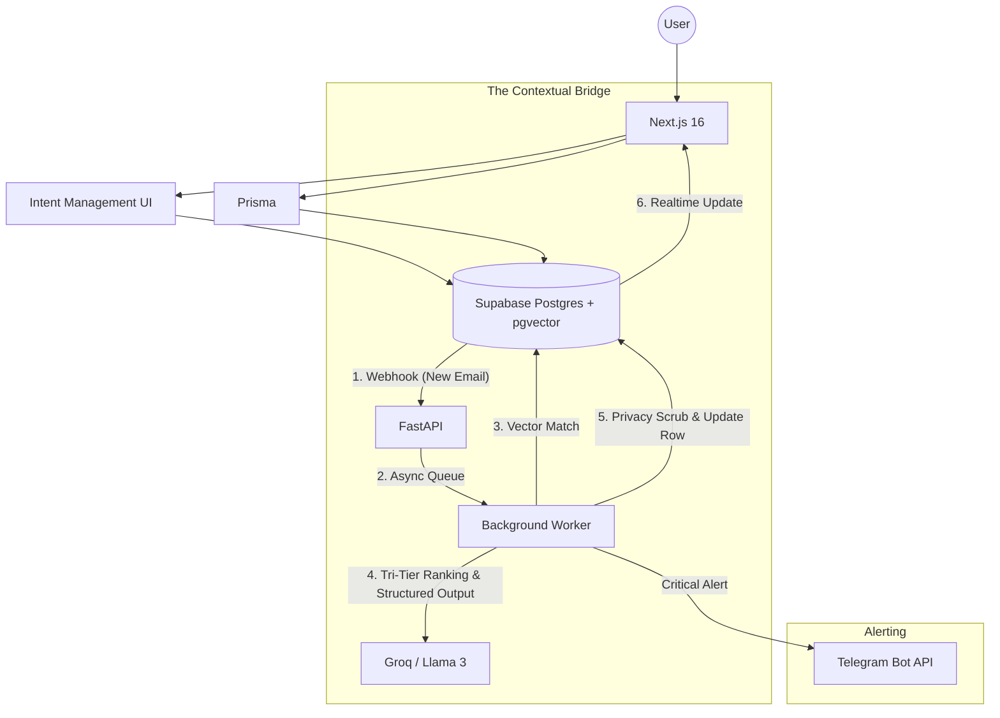

# Vigil: Product Development Plan

**Project Goal:** Solve "Information Blindness" by creating an intelligent gatekeeper for emails using LLMs and RAG, moving from a standard inbox to a priority-driven orchestration layer (Project Signal).

**Implementation status:** In the current repo, **Milestones 1–4** are implemented (auth, Prisma, Gmail/Microsoft read path, global inbox, intents + settings UI, schema for AI bridge, and the FastAPI Context Engine webhook + queue worker). **Milestone 5** is upcoming, expanding into alerts and optimization.

---

## Tech Stack Overview

| Component | Technology | Reasoning |
| --- | --- | --- |
| **Frontend / Orchestration** | **Next.js 16** (App Router), **React 19**, **Tailwind CSS v4** | Fast UI, App Router, API routes, OAuth, and email sync. |
| **UI components** | **shadcn** (v4) with **Base UI** primitives | Consistent, accessible building blocks. |
| **ORM / migrations** | **Prisma 6** on **Supabase Postgres** | Typed schema, migrations, and support for `pgvector`. |
| **Package manager** | **bun** | Fast installs and scripts for local/CI. |
| **Authentication** | **Auth.js (NextAuth v5 beta)** | OAuth2 for Google/Microsoft; sessions stored in Postgres. |
| **Primary database** | **Supabase (PostgreSQL + pgvector)** | Storage for emails, **User Intents**, and `vector(384)` embeddings. *(Replaces PRD's ChromaDB for architectural simplicity)* |
| **AI backend** | **FastAPI (Python)** | Processes AI logic via background queues; uses `sentence-transformers` for embeddings and structured outputs for LLM orchestration. |
| **LLM Strategy** | **Groq (Llama 3)** | High-speed inference for ranking and extraction. |
| **Alerting Channel** | **Telegram Bot API** | Specialized "Bypass Notifications" for critical alerts. |

---

## Milestone 1: The Foundation (Next.js & Auth) — done in repo

- **Project init:** Next.js 16, Tailwind v4, shadcn-style UI, **bun** for dependency management.
- **Database schema:** **Prisma** models for NextAuth (`User`, `Account`, `Session`, etc.), `Email`, and `SystemConfig`.
- **OAuth:** Google and Microsoft Entra; configure developer portals and redirect URIs.
- **Protected app routes:** **`src/proxy.ts`** (Next.js 16 request proxy pattern).

---

## Milestone 2: Core Email Logic (The "Read" Layer) — done in repo

- **API integration:** Server-side **Gmail** and **Microsoft Graph** fetchers.
- **Unified data model (UDM):** TypeScript types and mappers in `src/types/unified-email.ts`.
- **Global inbox UI:** **`/dashboard/inbox`** — batch sync and parallelized provider fetching; stores provider payloads in **`Email.raw`**. *(Ensure syncing tags Inbox vs Sent mail to future-proof for PRD Phase 2 automatic intent detection).*

---

## Milestone 3: The Context Engine UI & Intelligence Bridge

**Objective:** Allow users to define "Active Intents" and connect the Next.js frontend to the AI backend.

- **Intent Management UI (implemented in repo):**
  - Create **`/dashboard/intents`** to allow natural language "Active Intent" input.
  - Implement the **`Intent`** Prisma model to store user goals and deadlines.
  - *Security Note:* E2E Encryption for intents (from original PRD) is dropped for MVP to allow server-side embedding generation. Relies on Supabase RLS and TLS.
- **Settings UI Update (implemented in repo):** Add Telegram chat id field to **`/dashboard/settings`** and the `User` schema.
- **Zero-Retention Privacy toggle (future work):** A UI toggle and schema field (e.g. `User.zeroRetention`) are not implemented yet; backend scrubbing is intentionally disabled until that exists (see `backend/README.md`).
- **FastAPI setup (implemented in repo):** A Python API receives Supabase webhooks at `POST /api/webhooks/email` and enqueues work immediately (no LLM work in the request handler).
- **Supabase webhooks (partially implemented):**
  - **Email ingest webhook (implemented):** configure Supabase to call `POST /api/webhooks/email` when `Email` rows should be processed.
  - **Intent-change embedding trigger (future work):** triggering FastAPI on `Intent` `INSERT/UPDATE` to generate embeddings is planned but not wired end-to-end yet.
- **Shared DB access (implemented in repo):** FastAPI connects to Supabase with the **service role** key (bypasses RLS) to read/write rows for AI processing.

---

## Milestone 4: Context-Aware AI & Tri-Tier Ranking

**Objective:** Implement LLM-based filtering using the user's life context (Intents).

- **The Contextual Loop:**
  1. **Next.js** saves an email to DB (Status: `PENDING`).
  2. **FastAPI** receives the webhook and immediately pushes the `email_id` to an **async background queue** to prevent webhook storms and API rate limits.
  3. **Intent Matching (implemented in repo):** rank active intents in-process using embeddings + cosine similarity (the DB supports `pgvector`, and in-DB matching remains a potential future optimization).
  3b. **Internal RAG (implemented in repo):** after each successful classification, persist a `vector(384)` on **`Email.embedding`**; future runs retrieve similar **completed** emails as few-shot context (tagged separately from the email body) instead of re-embedding a sliding window every time. Optional **web** snippets (Tavily) use the same separation.
  4. **Tri-Tier Scoring:** LLM (Llama 3) classifies the email into: **Critical** (Immediate), **Relevant** (Digest), or **Low-Value** (Mute).
  5. **Action Extraction:** Use **Structured Outputs** (e.g., via `instructor` or LangChain) to identify specific tasks and force a strict JSON array format for the `actions` column.
  6. **Temporal Decay:** Adjust scores automatically as user-defined deadlines in `Intent` approach.
  7. **Privacy Scrubbing (Zero-Retention) (future work):** once a `User.zeroRetention` flag exists, FastAPI can strip sensitive content (e.g. email body) from `Email.raw` before marking rows `COMPLETED`.
- **Real-time UI:** Use **Supabase Realtime** to update the inbox with `vigilScore`, `category`, and `actions` without a page reload.

---

## Milestone 5: Multi-Channel Alerts & Optimization

- **Bypass Notifications:**
  - Implement a **Telegram Bot** integration.
  - When an email is classified as **"Critical"**, FastAPI triggers an instant Telegram alert to bypass standard inbox noise.
- **Smart Digest:** Create a "Daily Digest" view in Next.js for emails classified as "Relevant."
- **Feedback loop:** Allow users to mark an email as "Incorrectly Categorized" to fine-tune the LLM prompt.
- **Search & chat:** "Chat with your Inbox" feature using the RAG pipeline.

---

## Key Implementation Secrets for Solo Devs

1. **The database is the bus:** Use Supabase webhooks to trigger AI tasks. This makes the system resilient; if FastAPI is down, webhooks can retry or `PENDING` tasks wait in the DB.
2. **Avoid request-response for AI:** AI tasks are slow. Never make the Next.js frontend wait for an LLM response. Use the "Write → Webhook → Realtime" loop instead.
3. **Embeddings for Context:** Don't just send the email to the LLM. Match it against the user's **Intents** first using vector similarity to provide the LLM with the right context.
4. **Local development:** Use `ngrok` to expose your local FastAPI port so Supabase (cloud) can send webhooks to your local machine.
5. **Rate Limit Handling (Webhook Storms):** A single Next.js sync can fetch 100 emails, causing Supabase to fire 100 simultaneous HTTP webhooks. FastAPI must immediately acknowledge the webhook and push the `email_id` into a background queue (like `asyncio.Queue` or Celery) to process sequentially safely.
6. **Structured LLM Outputs:** Always force the LLM to return strictly formatted JSON for `actions` to prevent Next.js UI crashes during JSON parsing.

---

## Architecture Diagram (Context-Aware)

